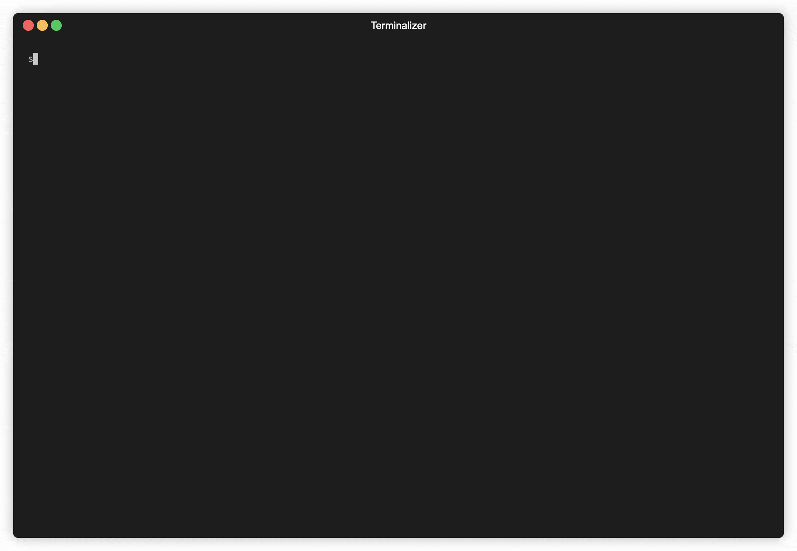

## saucectl & Postman example using Sauce Orchestrate

### What is the purpose of this repo?
The purpose of this repo is to show extensibility of ```saucectl```.

Here is an example of [Newman](https://learning.postman.com/docs/collections/using-newman-cli/installing-running-newman/), a command-line Collection Runner for Postman, with ```saucectl``` such that you can run your Postman collections in Sauce Labs cloud and view these test results & [Insights](https://docs.saucelabs.com/insights/) under one roof.

This repo contains a simple set of ````HTTP```` crud method requests and test assertions created using Postman, which can be run using ```saucectl```.

Behind the scenes, the tests and the Newman CLI is packaged in a Newman docker image that can be run in Sauce Labs cloud, and also as part of your CI pipeline. At the end of the test run, test result output from Newman is shown on the terminal in addition to a test execution summary from ```saucectl```. The docker container is run in Sauce Labs cloud using our [Sauce Orchestrate](https://docs.saucelabs.com/hosted-orchestration/) that is in beta at the moment.

#### What are the pre-requisites?
To run this test suite, you will need
- docker installed and working, in case you would like to rebuild the image
- ```saucectl``` installed and configured to use your Sauce Labs credentials
- this repo cloned or checked out to your local machine

#### How do I install ```saucectl```?
You will need Node.js 16 or higher and npm 8 or higher. More information can be found [here](https://docs.saucelabs.com/dev/cli/saucectl/#system-requirements) on Sauce Labs docs.

```npm install -g saucectl```

For an existing installation of ```saucectl```, we recommend upgrading.

```npm upgrade -g saucectl```

#### How do I configure ```saucectl```?

You can do so by using the configure option, detailed information is available [here](https://docs.saucelabs.com/dev/cli/saucectl/configure/). You will need your Sauce Labs username and authentication key which can be found in acccount settings.

```saucectl configure```

### How do I run tests using ```saucectl```?



```saucectl``` runs tests for you via the following command. No matter which framework or type of test you run, the command remains the same.

Before running the command, please ensure this repo is your working directory in your terminal session as ```./sauce/config.yml``` has the logic and sequence in which tests need to be run.

```saucectl run```

#### Where can I view the config?

[Here](.sauce/config.yml) you can see how `saucectl` is configured for this repository.

Our IDE Integrations (e.g. [Visual Studio Code](https://docs.saucelabs.com/dev/cli/saucectl/usage/ide/vscode)) can help you out by validating the YAML files and provide handy suggestions, so make sure to check them out!

### Where do I view test results?
You have the following options:
1. Test results are shown on the terminal
- Newman test result output is shown that gives you a detailed view
- a test execution summary is shown by ```saucectl```
2. Based on the ```config.yml``` in this repo, your test results will also be stored in ```./artifacts```

You can also query our API endpoint with ```runid``` and your Sauce Labs credentials. OpenAPI spec can be found [here](https://github.com/saucelabs/hostedrunner-api/blob/main/specs/openapi_v1alpha1.yaml).

```https://api.{{HOSTNAME}}/v1alpha1/hosted/image/runners/{{RUNID}}```
- HOSTNAME: your Sauce Labs data center
- RUNID: your test ```runid``` shown during test execution on the terminal

---


:checkered_flag: Thank you for reading this far, hope you found this useful.
